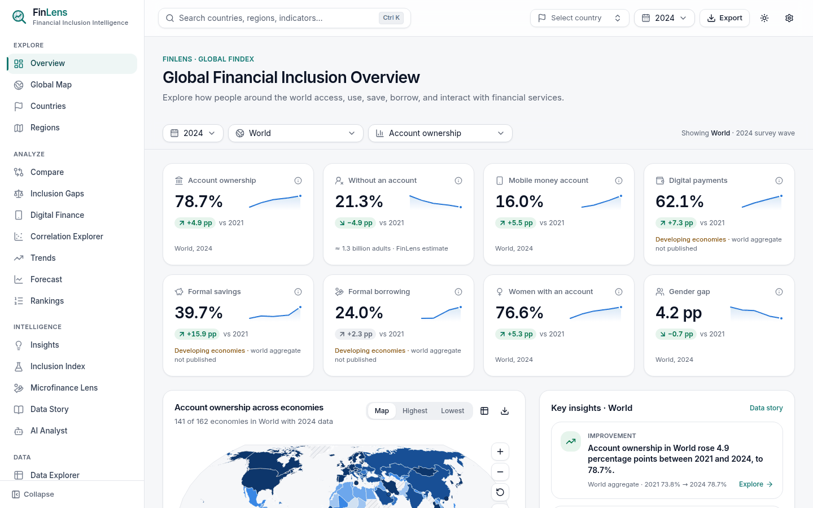
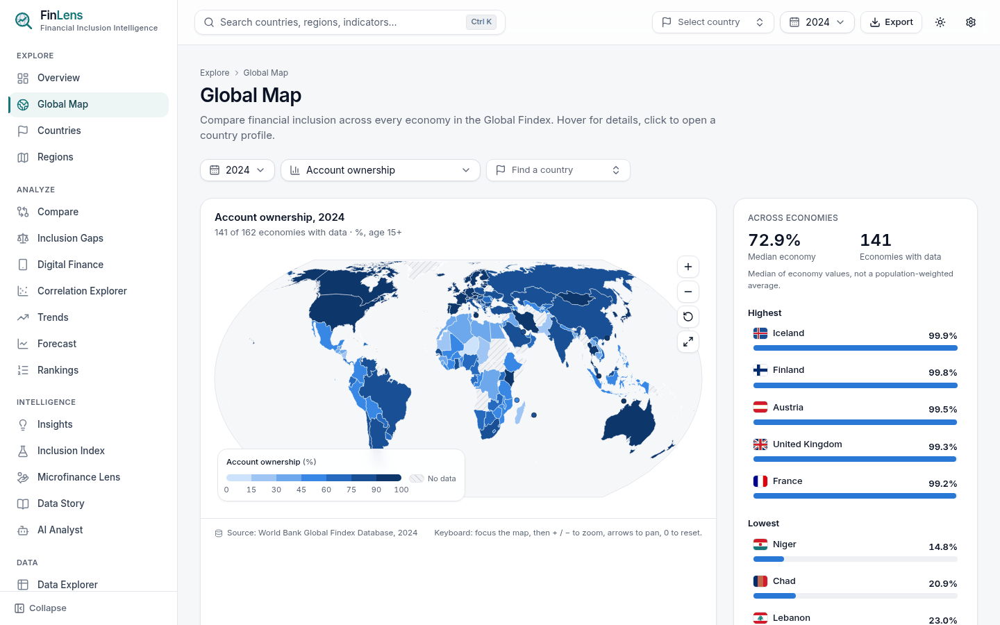
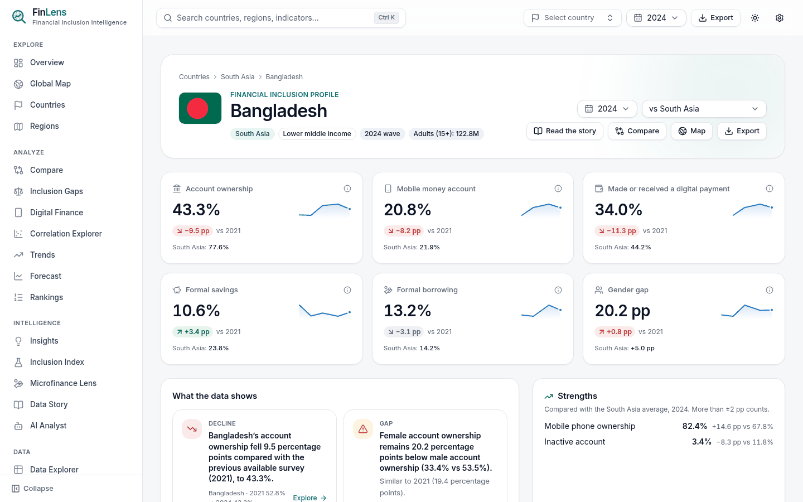
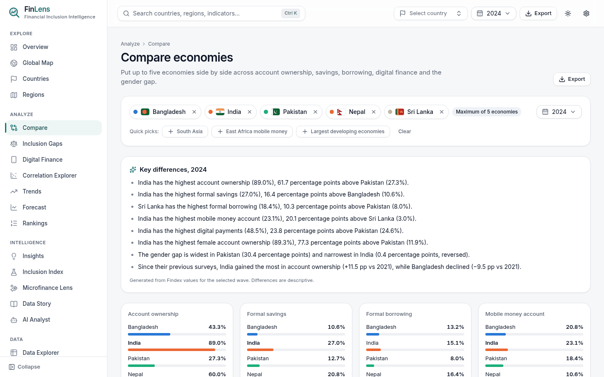
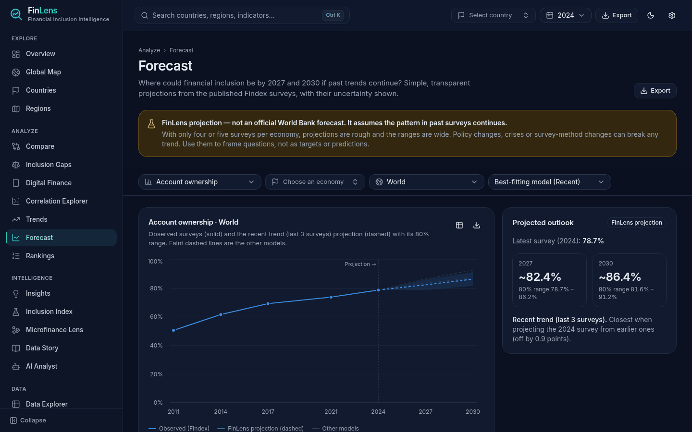
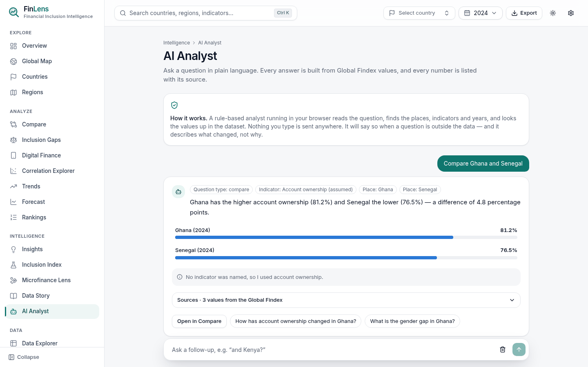
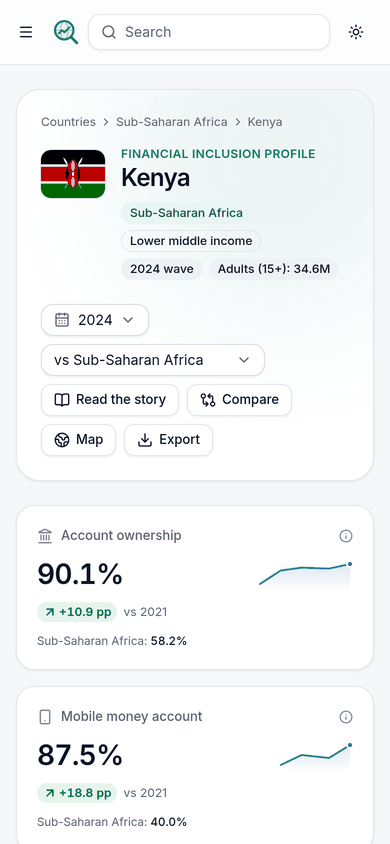

<div align="center">

# FinLens

### Global Financial Inclusion Intelligence Platform

Explore how adults in 162 economies access, use, save, borrow and cope with financial shocks,
built entirely on the **World Bank Global Findex Database 2025**.




</div>

---

## Why FinLens

About 1.3 billion adults still have no account at a bank, other financial institution or mobile
money provider. Most of them live in developing economies, and many of them are women and
people in the poorest households. The Global Findex shows where these gaps are, but it
is published as a large spreadsheet of 430 series.

FinLens turns that spreadsheet into an analytical tool for researchers, policy teams,
development practitioners and anyone working on financial inclusion. The goal is to make it
easier to see **who is left out, where, and how that is changing**.

### Principles

| Principle                          | In practice                                                                                                                   |
| ---------------------------------- | ----------------------------------------------------------------------------------------------------------------------------- |
| **Published data only**            | Every number on screen comes from the Findex. Missing values stay missing and are never filled or estimated.                  |
| **Derived values are labelled**    | Forecasts, the composite index and any calculated figure are marked _FinLens-derived_, never presented as World Bank figures. |
| **Correlation ≠ causation**        | Every relationship view says so. The app describes what changed, not why.                                                     |
| **No political judgements**        | Economies are compared on data, not ranked as "good" or "bad".                                                                |
| **One template for every economy** | No country-specific code paths; every economy gets the same analysis.                                                         |
| **Private by design**              | Everything runs in the browser. No accounts, no tracking, no personal data.                                                   |

---

## Features

| Area             | Pages                                                                                    | What you can do                                                                                                                                                                                                                                                                                             |
| ---------------- | ---------------------------------------------------------------------------------------- | ----------------------------------------------------------------------------------------------------------------------------------------------------------------------------------------------------------------------------------------------------------------------------------------------------------- |
| **Explore**      | Overview · Global Map · Countries · Regions                                              | KPIs for the World, any region or income group; an interactive choropleth map; profiles of every economy; regional deep dives                                                                                                                                                                               |
| **Analyze**      | Compare · Inclusion Gaps · Digital Finance · Correlation · Trends · Forecast · Rankings  | Compare up to five economies; gaps by gender, income, education, age, employment and residence; mobile money pathways; relationships between indicators; long-run trends; transparent projections to 2027 and 2030 with uncertainty ranges                                                                  |
| **Intelligence** | Insights · Inclusion Index · Microfinance Lens · Country Focus · Data Story · AI Analyst | A rule-based insight engine with evidence for each finding; an experimental composite index with adjustable weights; a view of saving, borrowing and who is excluded; narrative briefs for any economy; a guided data story; a plain-language analyst that answers only from the data and lists its sources |
| **Data**         | Data Explorer · About the Data                                                           | Query all 430 series by economy, wave and population group, then download exactly your selection as CSV. Methodology notes and citation included                                                                                                                                                            |

**Across the app:**

- Every view's state is kept in the URL, so a copied link opens exactly that view.
- You can export each chart as PNG or CSV, and each page as a snapshot, all its data, or a Markdown summary. Every download includes the World Bank citation.
- Light and dark themes are available, along with a keyboard-accessible command palette (<kbd>Ctrl</kbd>/<kbd>⌘</kbd> + <kbd>K</kbd>).
- The layout is built for phones and tablets as well as desktop, with touch-sized controls.
- Charts include a data-table alternative, and the whole app is checked against the WCAG 2.1 AA accessibility standard.

<table>
  <tr>
    <td width="50%"><br><sub><b>Global Map</b>: account ownership across 141 economies, 2024</sub></td>
    <td width="50%"><br><sub><b>Country Profile</b>: every economy benchmarked against its region</sub></td>
  </tr>
  <tr>
    <td width="50%"><br><sub><b>Compare</b>: up to five economies with generated key differences</sub></td>
    <td width="50%"><br><sub><b>Forecast</b>: labelled FinLens projections with 80% ranges (dark theme)</sub></td>
  </tr>
  <tr>
    <td width="50%"><br><sub><b>AI Analyst</b>: answers grounded in Findex values, with sources</sub></td>
    <td width="50%" align="center"><br><sub><b>Mobile</b>: every page works at phone size</sub></td>
  </tr>
</table>

---

## Getting started

**Requirements:** Node.js 20.19 or newer (22 recommended) and npm.

```bash
git clone <your-repository-url> finlens
cd finlens
npm install
npm run dev            # → http://localhost:5173
```

The processed Findex data is already in `public/data/processed/`, so the app runs straight after
install. You do not need the original spreadsheet unless you want to rebuild the data.

### Commands

| Command                              | What it does                                                                            |
| ------------------------------------ | --------------------------------------------------------------------------------------- |
| `npm run dev`                        | Start the development server                                                            |
| `npm run check`                      | Full pre-release check: verify data → lint → type-check → unit tests → production build |
| `npm run build` / `npm run preview`  | Production build in `dist/` / serve it locally with the production security headers     |
| `npm test` / `npm run test:coverage` | Unit and integration tests, and coverage with thresholds                                |
| `npm run test:e2e:install`           | One-time download of Chromium for the browser tests                                     |
| `npm run test:e2e`                   | Browser tests: every page on desktop and mobile, key journeys, accessibility checks     |
| `npm run data:build`                 | Rebuild `public/data/processed/` from the Findex workbook in `public/data/raw/`         |
| `npm run data:verify`                | Check the processed data (references, duplicates, value ranges)                         |
| `npm run geo:build`                  | Rebuild the world map (`public/geo/`) and flags (`public/flags/`)                       |

---

## Data

|              |                                                                                                                           |
| ------------ | ------------------------------------------------------------------------------------------------------------------------- |
| **Source**   | World Bank, _The Global Findex Database 2025_ (release: September 2025)                                                   |
| **Coverage** | 162 economies and 12 aggregates (World, regions, income groups, developing economies)                                     |
| **Waves**    | 2011, 2014, 2017, 2021, 2024. Fieldwork done in 2022 is placed in the 2021 wave, as the World Bank does.                  |
| **Series**   | 430 published series, with breakdowns for 13 population groups, plus 3 FinLens-derived indicators that are clearly marked |

### Updating to a new Findex release

1. Download the workbook from the [Global Findex site](https://www.worldbank.org/en/publication/globalfindex) and place it in `public/data/raw/`. That folder is git-ignored and never deployed.
2. Run `npm run data:build`, then `npm run data:verify` and `npm test`.
3. Commit `public/data/processed/`. Users receive the new data automatically on their next visit.

The pipeline records every cleaning rule it applies, such as zeros for questions that were not
asked. You can see them on the in-app **About the Data** page and in
[`docs/DATA_MODEL.md`](docs/DATA_MODEL.md).

---

## Architecture

```
src/
├── app/          Router and lazy-loaded routes
├── config/       Route registry and typed environment settings
├── data/         Types, indicator registry, repository (the only way the UI reads data)
├── lib/          Business logic: analytics, forecasting, insights, AI analyst, export, formatting
├── features/     One folder per page: <Page>.tsx (UI) + <page>.logic.ts (pure, tested logic)
├── components/   Reusable UI: charts, map, layout, export, shadcn/ui primitives
├── store/        Zustand stores (theme, UI, data)
└── styles/       Design tokens and global CSS
scripts/          Data pipeline, map builder, data verifier (Node)
tests/unit/       Vitest unit and integration tests (golden values from the source workbook)
tests/e2e/        Playwright page, journey and accessibility tests
deploy/           nginx configuration for self-hosting
docs/             Architecture, data model, design system, deployment
```

**Stack:** React 19 · TypeScript · Vite · Tailwind CSS 4 · shadcn/ui (Radix) · Recharts ·
D3 (map, scales) · Zustand · React Router · Framer Motion · Lucide icons ·
Vitest · Playwright · axe-core

Business logic stays out of the UI components. Each page's calculations live in a pure
`*.logic.ts` module, and those modules are tested directly against the real dataset.

---

## Quality and testing

| Layer             | What is checked                                                                                                                              |
| ----------------- | -------------------------------------------------------------------------------------------------------------------------------------------- |
| **Data**          | Every processed value is a finite percentage in [0, 100], with no duplicate rows and valid references, and every indicator has its data file |
| **Logic**         | 137 unit and integration tests, including published values checked against the workbook. Coverage of the logic modules is kept above 85%.    |
| **Pages**         | All 23 pages on desktop and a phone-sized screen: no errors, no failed requests, no sideways scrolling                                       |
| **Journeys**      | Search, profiles, comparisons, AI Analyst, CSV and PNG export, deep links, dark mode, mobile menu                                            |
| **Accessibility** | Automated WCAG 2.1 A/AA checks with axe-core on every page, in light and dark themes                                                         |
| **Security**      | Strict Content-Security-Policy (no inline scripts, no framing). The browser tests run under the same policy as production.                   |

Automated accessibility tests catch only part of the issues. Before a major release, test the key
pages with a keyboard and a screen reader as well.

---

## Deployment

FinLens is a static site with no server, database or API keys. Ready-made configuration is
included for:

| Host                   | Configuration                                                        |
| ---------------------- | -------------------------------------------------------------------- |
| **Netlify**            | `netlify.toml`, `public/_headers`                                    |
| **Vercel**             | `vercel.json`                                                        |
| **Cloudflare Workers** | `wrangler.jsonc`, `public/_headers`                                  |
| **Self-hosted**        | `Dockerfile` + `deploy/nginx.conf` (unprivileged nginx on port 8080) |

```bash
docker build -t finlens .
docker run --rm -p 8080:8080 finlens
```

The included GitHub Actions workflow (`.github/workflows/ci.yml`) runs every check on each push and
pull request. For step-by-step hosting instructions, caching and security headers, and a release
checklist, see [`docs/DEPLOYMENT.md`](docs/DEPLOYMENT.md).

---

## Documentation

| Document                                    | Contents                                                                        |
| ------------------------------------------- | ------------------------------------------------------------------------------- |
| [Architecture](docs/ARCHITECTURE.md)        | Layers, folder structure, page-by-page design decisions, roadmap                |
| [Data model & pipeline](docs/DATA_MODEL.md) | Findex ingestion, cleaning rules, indicators, population groups, repository API |
| [Design system](docs/DESIGN_SYSTEM.md)      | Tokens, colour palettes and their validation, chart conventions, components     |
| [Testing & deployment](docs/DEPLOYMENT.md)  | Test layers, hosting options, CI, release checklist                             |

---

## Citation and credits

If you use figures from FinLens, please cite the original source:

> World Bank. _The Global Findex Database 2025._ Washington, DC: World Bank.
> <https://www.worldbank.org/en/publication/globalfindex>

Every download from FinLens includes this citation and a link back to the view it came from.
Use of the data is subject to the World Bank's
[terms of use](https://datacatalog.worldbank.org/).

- **Data:** World Bank Global Findex Database
- **Basemap:** Natural Earth via [`world-atlas`](https://github.com/topojson/world-atlas) (public domain)
- **Flags:** [`flag-icons`](https://github.com/lipis/flag-icons) (MIT)
- **Typeface:** Inter via Fontsource (SIL Open Font License)

FinLens is an independent analytical tool. It is not affiliated with or endorsed by the
World Bank. Projections and the composite index are FinLens calculations, not official
statistics.

## License

No licence has been chosen for this repository yet. Until one is added, all rights are
reserved by the project owner.
